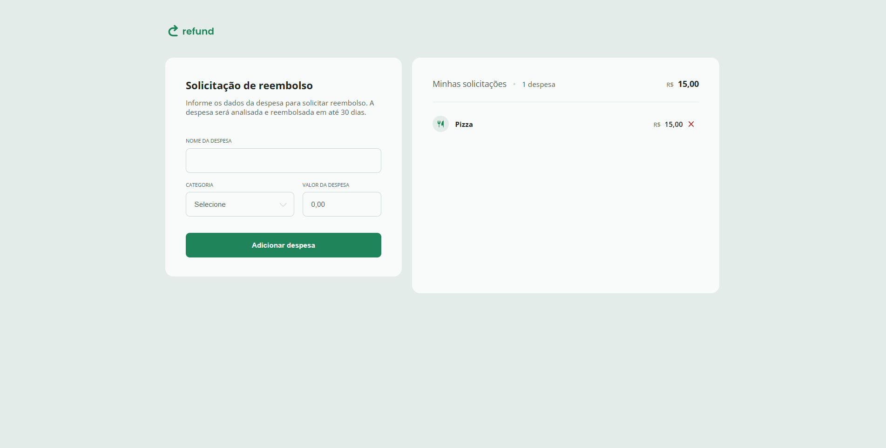

# Refund

  
_Preview da interface do sistema de reembolso._

Projeto desenvolvido como parte do curso **Full-Stack da Rocketseat**, com foco na aplicação prática de **JavaScript**, integrando lógica de programação, manipulação do DOM e gerenciamento de estados para construção de um sistema de reembolso funcional.

## Tecnologias Utilizadas

- **HTML5**
- **CSS3**
- **JavaScript**

## Objetivo do Projeto

O objetivo deste projeto é desenvolver um **sistema de controle de reembolsos**, aplicando conceitos essenciais de JavaScript intermediário.

O projeto simula uma situação real de cadastro e controle de despesas para reembolso, reforçando boas práticas de legibilidade, organização e separação de responsabilidades na aplicação.

## Como visualizar o projeto

### 1. Clone o repositório

```bash
git clone https://github.com/muddyorc/refund.git
```
